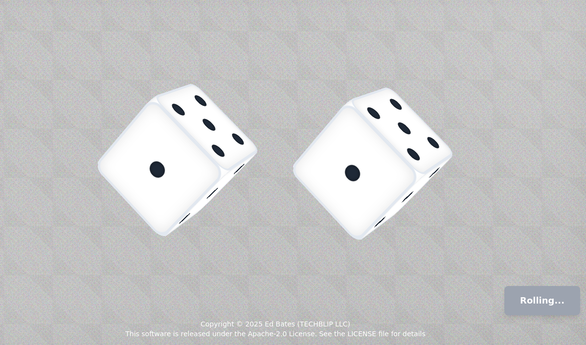

# 3D Dice Roller

[](https://opensource.org/licenses/Apache-2.0)  [](https://www.typescriptlang.org/)  [](https://reactjs.org/)  [](https://vitejs.dev/)  [](https://tailwindcss.com/)  [](https://eslint.org/)

Interactive 3D dice rolling application built with React, TypeScript, and CSS 3D transforms. Roll 3D virtual dice with animations and sound effects.

## Features

- Realistic 3D dice
- Random number generation using `crypto.getRandomValues()`
- Sound effects
- Keyboard support (Space to roll)
- Responsive design
- Accessibility features



## Getting Started

### Prerequisites

- Node.js 18.0.0 or higher
- npm 7.0.0 or higher

### Installation

1. Clone the repository

```bash
git clone https://github.com/yourusername/3d-dice-roller.git
cd 3d-dice-roller
```

2. Install dependencies

```bash
npm install
```

3. Start the development server

```bash
npm run dev
```

4. Open your browser and navigate to `http://localhost:5173`

## Available Scripts

- `npm run dev` - Start development server
- `npm run build` - Build for production
- `npm run preview` - Preview production build
- `npm run test` - Run tests
- `npm run lint` - Lint code

## Technology Stack

- React 18
- TypeScript
- Vite
- Tailwind CSS
- Vitest for testing
- ESLint for linting

## Project Structure

```
src/
├── components/
│   └── ErrorBoundary.tsx
├── hooks/
│   └── useSound.ts
├── __tests__/
│   └── App.test.tsx
├── App.tsx
├── main.tsx
└── index.css
```

## Features in Detail

### 3D Animation System

- Custom-built 3D animation system using CSS transforms
- Physics-inspired dice rolling animations
- Realistic wall impact effects
- Dynamic shadows and lighting effects

### Random Number Generation

- Cryptographically secure random number generation
- Ensures fair and unpredictable rolls
- Prevents duplicate consecutive rolls

### Sound System

- Roll sound effects with volume control
- Impact sound when dice hit the wall
- Graceful fallback if audio playback fails

### Accessibility

- ARIA labels for all interactive elements
- Keyboard navigation support
- High contrast visual elements
- Screen reader friendly

## Contributing

1. Fork the repository
2. Create your feature branch (`git checkout -b feature/AmazingFeature`)
3. Commit your changes (`git commit -m 'Add some AmazingFeature'`)
4. Push to the branch (`git push origin feature/AmazingFeature`)
5. Open a Pull Request

## Creator

Ed Bates (TECHBLIP LLC)

## Acknowledgments

- Sound effects from Mixkit
- Icons from Lucide React
- Inspiration from real-world dice physics

Some sections of this code were generated with the assistance of AI tools. These contributions were reviewed and integrated by the project creator(s).

## License

Apache-2.0 License - see the [LICENSE](LICENSE) file for details
